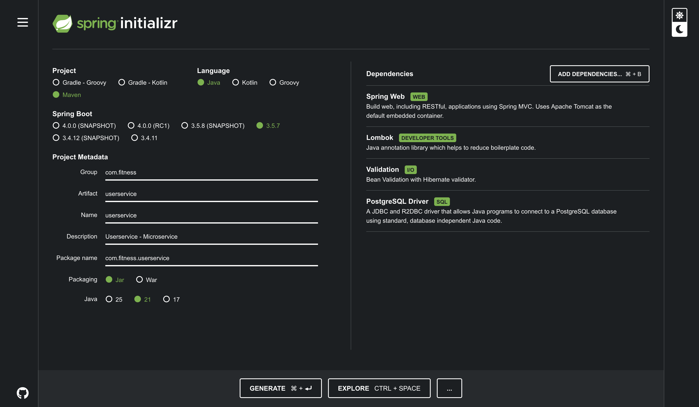
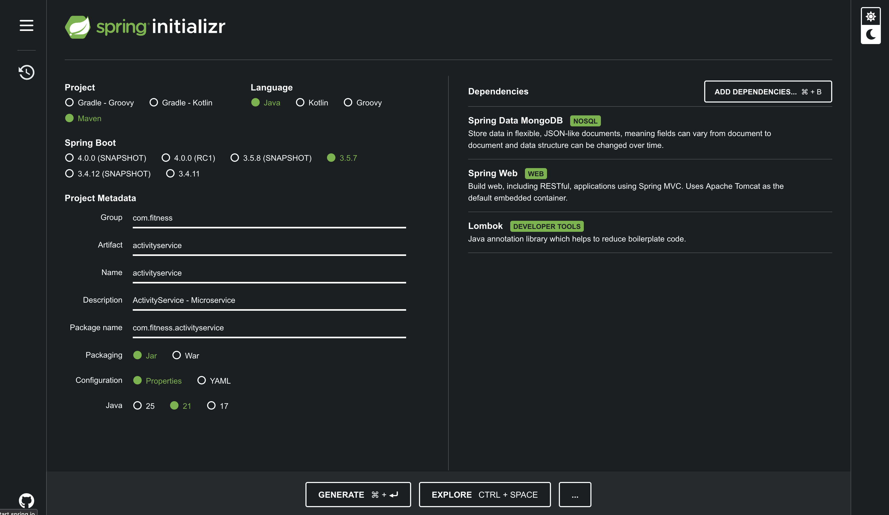
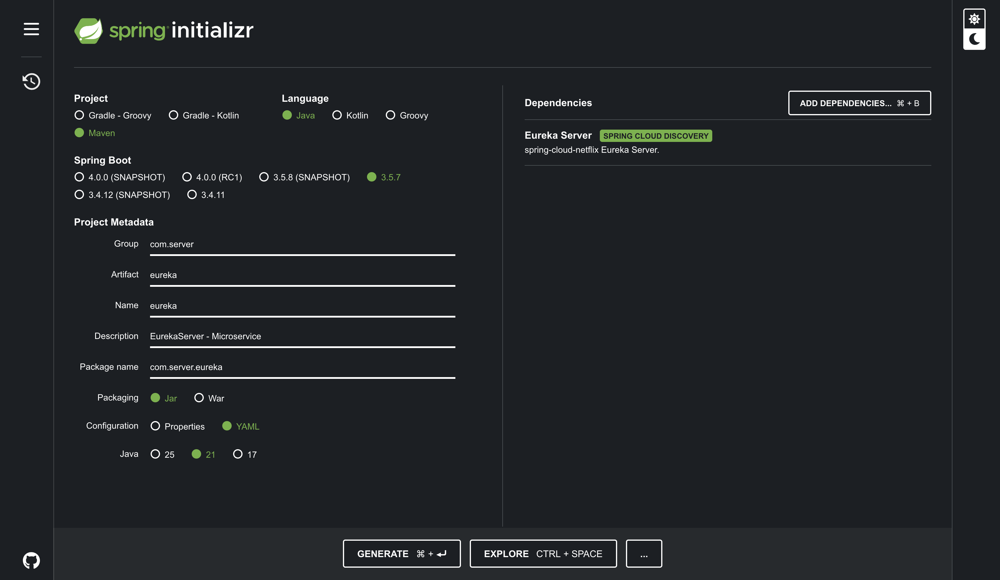
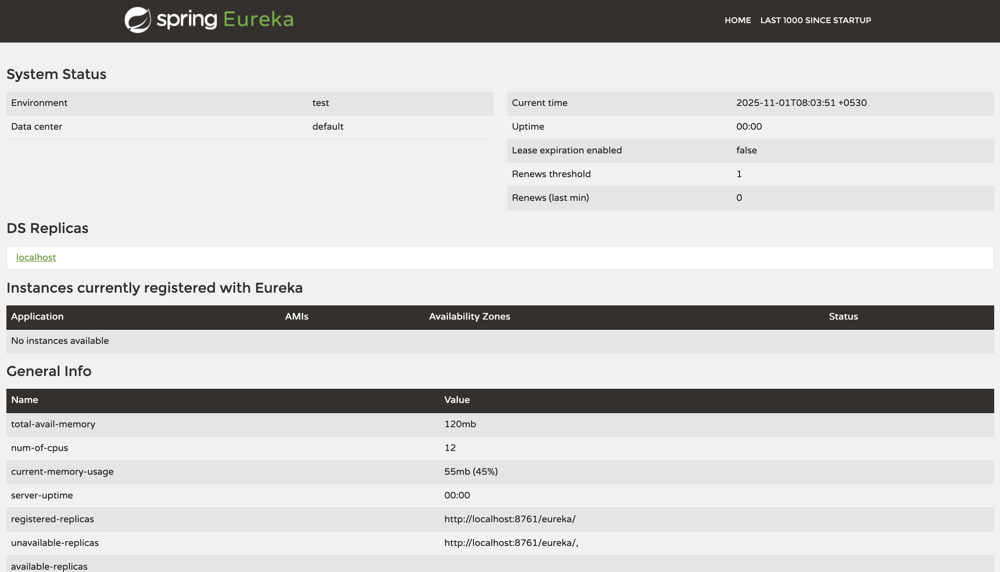
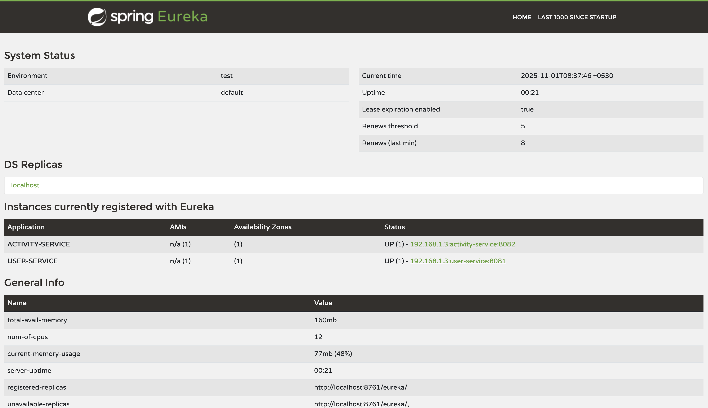
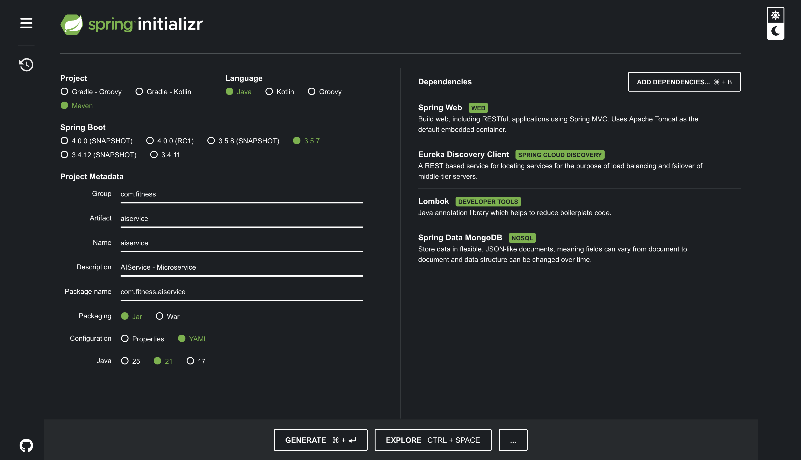

## Notes for stepwise process involved while building this application

1. Setting up services Required
2. Setting up Database Connections (Posgres and mongodb)
3. Start Building the endpoints

## User Microservice Initilizer



## Database Connection 

`microservices/userservice/src/main/resources/application.yml`
```yml
server:
  port: 8082

spring:
  application:
    name: userservice

  datasource:
    url: jdbc:postgresql://localhost:5433/fitness_user_db
    username: postgres
    password: postgres

  jpa:
    hibernate:
      ddl-auto: update
    database-platform: org.hibernate.dialect.PostgreSQLDialect
```

---

## Activity Microservice Initilizer



## Database Connection 

## Mongo DB Install in MAC

```

Download link : https://fastdl.mongodb.org/osx/mongodb-macos-arm64-8.2.1.tgz

sudo cp /Users/Aman/Downloads/mongodb-macos-aarch64--8.2.1/bin/* /usr/local/bin/

sudo ln -s  /Users/Aman/Downloads/mongodb-macos-aarch64--8.2.1/bin/* /usr/local/bin/

sudo chown Aman ~/data/db

sudo chown Aman ~/data/log/mongodb

nohup mongod --dbpath ~/data/db --logpath ~/data/log/mongodb/mongodb.log >/dev/null &

```

Then can install Mongodb Compass for GUI, there create a DB `fitnessactivity` and create one collection `activities`.

`microservices/activityservice/src/main/resources/application.yml`
```yml
server:
  port: 8082

spring:
  application:
    name: activityservice
  data:
    mongodb:
      uri: mongodb://localhost:27017/fitnessactivity
      database: fitnessactivity
```

---

## Adding Interservice Communication, Eureka Server

## Setting UP Eureka Server

create a spring-boot project for centralize server



add the configurations needed for server

application.yml
```yml
spring:
  application:
    name: eureka

server:
  port: 8761

eureka:
  client:
    register-with-eureka: false
    fetch-registry: false
```

In the `EurekaApplication.java` also add `@EnableEurekaServer` to make this application as Eureka Server.

Now, run the application



so, now the Eureka Server is up at `http://localhost/8761`

Note: For a standalone Eureka server that is not intended to register itself or discover other Eureka servers, register-with-eureka and fetch-registry is typically set to false.

---

## Now let's register microservices to the Eureka Server 

Step 1 : Add the eureka client dependencies to the microservice.

Step 2 : Add application configuration in Client 

eg:
```
eureka:
  client:
    serviceUrl:
      defaultZone: http://localhost:8761/eureka/
```

this will tell the client to register itself at which endpoint.

now, as we can see `User-Service` and `Activity-Service` is registered with Eureka Server.



---

so, far both the microservice is working as a individual service and there's no validation of checking whether there's any user with the passed user id in request to Activity microservice.

now, we have to add that check, so we will be need to make a `Interservice Communication` between `user-service` and `activity-service`, so that whenever a request comes to user-service with a userId field we can check that into user-service whether there exist any user with incoming userId.

we, will be using `Web Client` for the interservice communication.

so, we need to add this dependency in activity-service pom.xml :

```xml
<dependency>
    <groupId>org.springframework.boot</groupId>
    <artifactId>spring-boot-starter-webflux</artifactId>
</dependency>
```

## Similar to Activity Service we need to setup AI Service



`microservices/aiservice/src/main/resources/application.yaml`
```yml
spring:
  application:
    name: ai-service
  data:
    mongodb:
      uri: mongodb://localhost:27017/fitnessrecommendation
      database: fitnessrecommendation

server:
  port: 8083

eureka:
  client:
    serviceUrl:
      defaultZone: http://localhost:8761/eureka/
```

## Event Driven Architecture for (Recommendation - Generation)

so, to do that we can make use of Rabbit MQ, in spring boot project we can use `Spring AMQP`.

## Setting up Rabbit MQ Locally

[Docs for Installation](https://www.rabbitmq.com/docs/download)

Using Docker 

```sh
docker run -it --rm --name rabbitmq -p 5672:5672 -p 15672:15672 rabbitmq:4-management
```

Now, we can access the service on web console on [Rabbit MQ Web-Console](http://www.localhost:15672/)

username : guest
password : guest

## Let's Integrate Spring-AMQP

Activity-Service: dependency in pom.xml
```xml
<dependency>
  <groupId>org.springframework.boot</groupId>
  <artifactId>spring-boot-starter-amqp</artifactId>
</dependency>
```

Activity Service : application.yml
```yml
server:
  port: 8082

spring:
  application:
    name: activity-service
  data:
    mongodb:
      uri: mongodb://localhost:27017/fitnessactivity
      database: fitnessactivity
  rabbitmq:
    host: localhost
    port: 5672
    username: guest
    password: guest

eureka:
  client:
    serviceUrl:
      defaultZone: http://localhost:8761/eureka/

rabbitmq:
  exchange:
    name: fitness.exchange
  queue:
    name: activity.queue
  routing:
    key: activity.tracking
```


