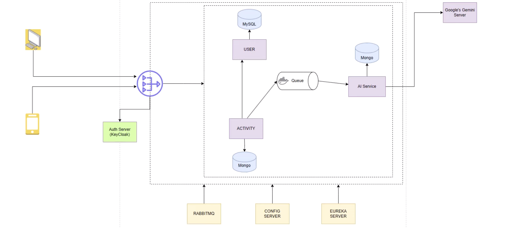

# Fullstack Microservices Application [Spring Boot - Backend], [React - Frontend]

## Fitness Application using AI

- Fully Featured Fitness App using Microservices

- AI integration in Microservices (Google - Gemini)

| Technology                   | Description                                                  |
|------------------------------|--------------------------------------------------------------|
| **Spring Boot**               | A framework to simplify the development of Java-based applications. |
| **Eureka Server (Spring Cloud Netflix)** | A service discovery server for microservices architecture. |
| **Spring Cloud Gateway**      | A gateway for routing requests to various microservices.    |
| **Keycloak**                  | An open-source identity and access management solution.     |
| **RabbitMQ (Spring AMQP)**    | A message broker to facilitate communication between microservices. |
| **PostgreSQL / MySQL**        | Relational databases for storing structured data.           |
| **Google Gemini API**         | Google’s AI-powered API for advanced search and data processing. |
| **Spring Cloud Config Server**| A central place to manage application configuration.        |

## High Level Diagram for Backend Flow

### High Level Flow

1. **Client Interaction**

   * Both web and mobile clients interact with the system via the **API Gateway**, which routes requests to appropriate microservices.
   * Authentication and authorization are managed through **Keycloak (Auth Server)** using OAuth2/OpenID Connect.

2. **Service Discovery and Configuration**

   * **Eureka Server** is used for **service discovery**, allowing services to dynamically locate each other.
   * **Spring Cloud Config Server** provides centralized **externalized configuration** for all microservices.

3. **Microservices**

   * **USER Service**: Handles user profiles, authentication linkage, and user data stored in **MySQL**.
   * **ACTIVITY Service**: Manages user activity such as what exercise the person is doing, persisted in **MongoDB**.
   * **AI Service**: Processes activity data and interacts with **Google’s Gemini API** for intelligent insights or recommendations.

4. **Asynchronous Communication**

   * **RabbitMQ** serves as the message broker for asynchronous event driven communication between services.
   * For example, when a user performs an action, an event is published to the queue, which the **AI Service** consumes for analysis.

5. **Databases**

   * **MySQL** is used for structured, relational data (e.g., users).
   * **MongoDB** is used for unstructured or activity/event based data (e.g., exercise, AI data).

6. **AI Integration**

   * The **AI Service** communicates with **Google’s Gemini API** to process user behavior and enhance system intelligence.

---

